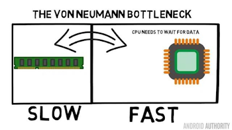
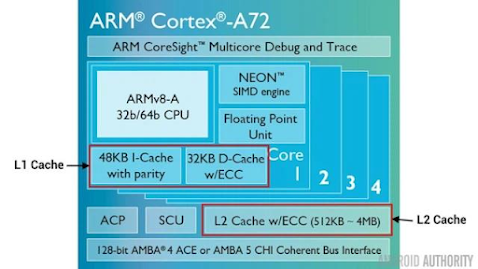

# Cache
----
## General
Most of the mobile phones and computers have cache. The micro-controller has cache as well.

- Firstly, it is well-known that the data of microcontroller will be push into RAM during run time (More at !(Reset sequence)[]). 
Thus, CPU will receive data fromn RAM. Since RAM's speed is fast, the microncontroller would have to push data into it when run!! At lease, read/write on RAM would be faster than on Flash.

- In reality, RAM speed is still low compared to CPU execution speed, which are 8-10 times faster. Thus, CPU has to wait for getting data from RAM, especially (muti-core) mictronctrollers require
a large amount of data to be processed, this waiting time will reduce the CPU efficiency

## Cache!!

This **bottleneck** reduce the micro-controller's efficiency tremendously. `Multi-core` can process a large amount of data for fast computing, CPU's waiting time, however, will result in the reduction of core's computing time
as same as RAM's speed. Thus, **cache**'s (in mictro-controller in this case) purpose are same as RAM but its speed is equal (or negligible less) than CPU's speed. Cache will store partial portion from RAM (optimized for CPU when needed)

2 ways for cache design
* Seperate cache into 2 parts: **I-Cache** (comprise Instruction) and **D-Cache** (comprise Data).
* Divide Cache into 2 levels. Level 1 runs with the same speed as CPU. Level 2 has more storage but run slower than CPU (but still faster than RAM's speed)

