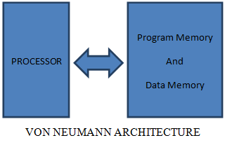
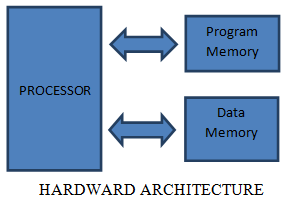

# Von Neumann and Hardvard architecture
----
There 2 digital architecture types descrbing functionality of computer: **Von Neumann**, which is designed by Von Neumann in the 1940s and **Harvard** used for seperately system memroy for data storage
## Von Neumann
Computer is the combination of ALU,CU,RAM and I/O devices.
The instructions are executed sequentially, once at a time, which limits the execution speed. This phenomenon is known as **von Neumann bottle neck**. In detail, this happens when the CPU execution speed is faster than memory acess execution speed.
Since the data and instruction program are stored in the same memory (RAM), `CU (control unit)` is responsible for distinguishing them. When CU start to call instructions to execute, it will call the `program counter` to reference the instruction's address in memory, fetched and executed by processor.
THe address of data that need to be processed is contained inside the instruction to be executed. During the fetch and execute stage, the PC will increase in order to point to its next instruction. The whole process is sequential, which means at instant, only 1 instruction is executed.

----
## Harvard architecture
Unlike Von Neumann, the Harvard architecture distinguish between program memory and data memory in order for them to fetched simultaneously, thus increasing the CPU's execution spped. Most of nowsaday DSP use Harvard architecture for speed guarantee.

A minor comparision between VonNeuMann and Harvard